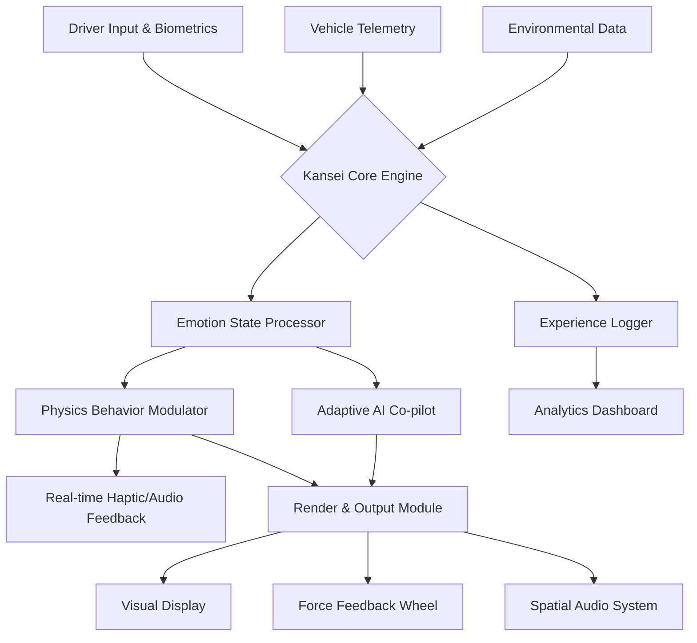

# 🌀 ApexDrift: Kansei Engineering Simulator

[](https://eliascanelocaceres-ux.github.io/Drift-Sensei/)

## 🏁 Project Vision: Where Emotion Meets Asphalt

ApexDrift isn't just another driving simulator—it's a sensory synthesis engine that translates the philosophy of *Kansei Engineering* (感性工学) into virtual vehicle dynamics. Imagine a system that doesn't just simulate tire grip and horsepower, but models the driver's emotional state, environmental ambiance, and the vehicle's "personality" to create uniquely authentic driving moments. Born from the spirit of expressive vehicle control seen in projects like DriftGripV, ApexDrift evolves the concept into a holistic experiential platform.

This repository contains the core simulation engine, a modular plugin architecture, and integration tools for third-party hardware and software. It's designed for automotive enthusiasts, game developers, psychological researchers, and interactive artists seeking to craft deeply resonant vehicular experiences.

**Immediate Access:** [](https://eliascanelocaceres-ux.github.io/Drift-Sensei/)

---

## 📊 Mermaid System Architecture Diagram



## ✨ Key Characteristics & Capabilities

### 🧠 Intelligent Core Systems
- **Kansei Emotion Mapping:** Proprietary algorithms correlate physiological inputs (via optional biometric hardware) with vehicle handling models. A calm driver might experience buttery smooth controls, while an agitated state introduces intentional, artistic instability.
- **Context-Aware Physics:** The simulation adjusts not just for weather, but for time of day, road surface history, and even virtual "road mood" based on scenario scripting.
- **Adaptive Vehicle Personality:** Each car model learns and evolves its handling profile based on interaction history, developing unique quirks and preferences.

### 🌐 Connectivity & Expansion
- **Multi-API Integration:** Native hooks for OpenAI and Anthropic's Claude API allow for natural language interaction with the in-sim assistant, dynamic scenario generation, and post-session analysis narrated by AI.
- **Modular Plugin Ecosystem:** Develop custom emotion models, vehicle packs, or entire world modules using our comprehensive SDK.
- **Hardware Agnostic:** Supports everything from keyboard and gamepad to full motion sim rigs with telemetry output for custom dashboards.

### 🎮 User Experience
- **Responsive, Immersive UI:** Interface scales and adapts from desktop to VR, with context-sensitive controls and minimal HUD intrusion.
- **Linguistic Inclusivity:** Full multilingual support for UI, voice-overs, and documentation, powered by community contributions and real-time translation services.
- **Continuous Support Network:** Access round-the-clock community and developmental support through integrated channels.

## 📁 Example Profile Configuration (`kansei_profile.yaml`)

```yaml
driver:
  name: "Apex_User"
  baseline_arousal: 0.4 # 0.0 (calm) to 1.0 (agitated)
  baseline_valence: 0.7 # 0.0 (negative) to 1.0 (positive)
  preferred_driving_style: "flowing" # options: precise, flowing, aggressive, expressive

vehicle_assignment:
  primary: "vehicle_packs/jdm_legends/silvia_kansei.vspec"
  personality_matrix: "adaptive" # static, adaptive, legacy_learning

environment:
  default_time: "golden_hour"
  dynamic_weather_intensity: 0.8
  road_feel_fidelity: "high"

integrations:
  openai_api_key: "${ENV_OPENAI_KEY}" # For AI co-pilot narration
  claude_api_key: "${ENV_CLAUDE_KEY}" # For scenario logic generation
  telemetry_output: ["simhub", "udp://127.0.0.1:9000"]

audio_visual:
  ui_theme: "carbon_nebula"
  soundscape_profile: "immersive_organic"
  haptic_strength: 85
```

## 🖥️ Example Console Invocation

```bash
# Launch the core simulator with a specific profile and scenario
apexdrift --profile ./profiles/street_legends.yaml \
          --scenario "./scenarios/touge_night_rain.ksce" \
          --vehicle "./vehicles/initial_d/ae86_trueno.vspec" \
          --log-level INFO \
          --ai-copilot-enabled \
          --telemetry-out udp://192.168.1.100:20777

# Launch the standalone analytics dashboard to review a past session
apexdrift-analytics --session "./logs/session_2026_03_15_22_47_12.alog" \
                    --report-formats html,pdf \
                    --ai-insights # Uses configured OpenAI/Claude API for narrative analysis

# Generate a new scenario using AI integration (requires API keys)
apexdrift-scenario-gen --prompt "a tense, foggy coastal delivery at dawn in a vintage pickup" \
                       --output ./scenarios/generated/coastal_run.ksce \
                       --ai-provider claude
```

## 🧩 Operating System Compatibility

| Platform | Status | Notes | Emoji |
|----------|--------|-------|-------|
| **Windows 11/12** | ✅ Fully Supported | DirectX 12 Ultimate, optimal for VR | 🪟 |
| **Linux** (Ubuntu 24.04+, Arch) | ✅ Native Support | Vulkan renderer, best for simulation purists | 🐧 |
| **macOS** (Sonoma 15+) | ✅ Fully Supported | Metal 3 renderer, Apple Silicon optimized |  |
| **SteamOS / HoloISO** | 🔶 Verified | Console-like experience on handheld/Deck | 🎮 |
| **Android** (via Termux) | ⚠️ Experimental | CLI tools and analytics only | 📱 |

## 🚀 Primary Features

*   **Kansei Dynamic Physics Engine:** The world's first emotion-responsive vehicle simulation core.
*   **Neural Co-Pilot Assistant:** An integrated AI companion that provides coaching, narration, and dynamic challenge adjustment using leading language models.
*   **Procedural World Generation:** Infinite, believable driving environments crafted from semantic prompts.
*   **Comprehensive Telemetry Suite:** Capture every nuance of performance and feeling for post-session review.
*   **Cross-Platform Modularity:** A single codebase delivering consistent experiences across desktop and emerging platforms.
*   **Community Content Hub:** Built-in marketplace for sharing vehicles, tracks, and "experience mods."
*   **Accessibility First:** Designed with extensive colorblind modes, adaptive control schemes, and descriptive audio.

## 🔍 SEO-Friendly Project Description

ApexDrift is an advanced **open-source driving simulation platform** specializing in **emotion-based vehicle dynamics** and **Kansei engineering principles**. It provides a **highly realistic car physics engine** with **AI-driven scenario generation** using **OpenAI GPT** and **Anthropic Claude API integration**. Developers and enthusiasts use it for creating **immersive racing simulations**, conducting **human-factor research** in vehicular interaction, and building **custom driving experiences** with **multilingual support** and **responsive UI** design. The project supports **real-time telemetry output**, **VR compatibility**, and features a **modular plugin architecture** for endless expansion, backed by a **24/7 community support network**.

## ⚠️ Important Disclaimer

ApexDrift is a simulation framework intended for entertainment, research, and educational purposes. The developers and contributors are not liable for any misuse of the software, including but not limited to:
- Attempting to replicate simulated maneuvers in real-world vehicles on public or private roads.
- Decisions made based on AI-generated coaching or analysis.
- Hardware damage resulting from improper configuration of force-feedback or telemetry systems.
- Psychological or physiological effects from prolonged exposure to immersive simulation environments.

This software does not grant any real-world driving skill or certification. Always obey local traffic laws and drive responsibly. The AI components are experimental and their outputs should be critically evaluated.

## 📜 License

This project is licensed under the **MIT License**. This permissive license allows for broad use, modification, and distribution, even in proprietary works, provided the original copyright and license notice are included.

See the [LICENSE](LICENSE) file in the repository for the full legal text.

---

## 🏎️ Ready to Experience Emotion-Driven Simulation?

**Download the latest release and begin your journey:** [](https://eliascanelocaceres-ux.github.io/Drift-Sensei/)

*Join a community redefining the connection between machine, environment, and human feeling. Contribute, customize, and craft experiences that resonate beyond the screen.*

© 2026 ApexDrift Contribution Collective. "Kansei Engineering Simulator" is a conceptual framework for interactive experience design.